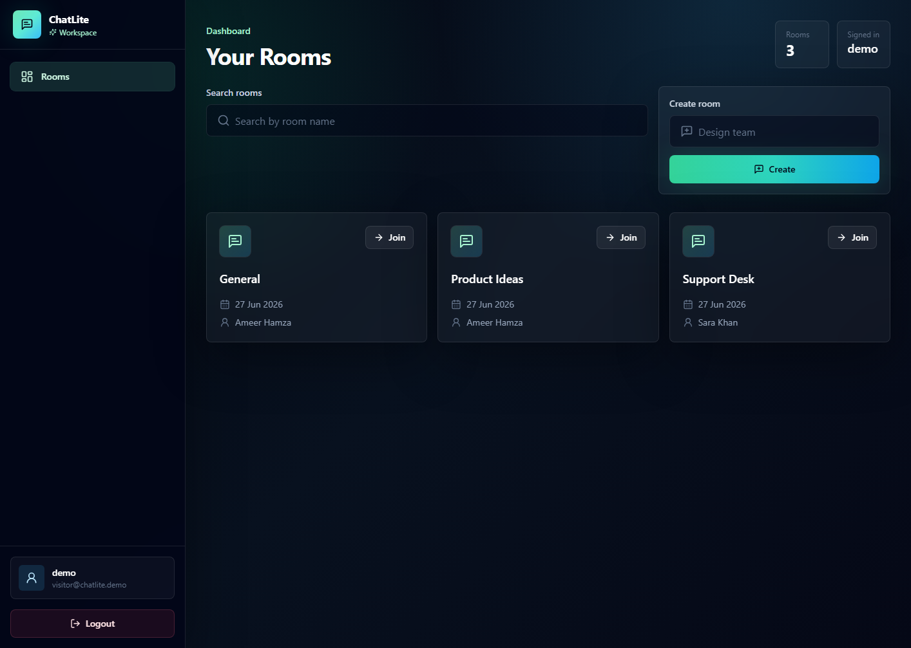

# ChatLite

ChatLite is a minimal real-time chat application with authentication, chat rooms, Socket.io messaging, and MongoDB message history. It uses a modern dark SaaS interface built with React, Vite, Tailwind CSS, Lucide React, Framer Motion, and React Hot Toast.

## Features

- Register and login with name, email, and password
- JWT authentication for protected REST APIs
- JWT authentication for Socket.io connections
- Create chat rooms
- View all available rooms
- Join a room and send real-time messages
- Save messages in MongoDB
- Load old message history when opening a room
- Show sender name, message text, and time
- Logout with localStorage session cleanup
- Responsive premium dark UI for desktop and mobile

## Tech Stack

- Frontend: React, Vite, Tailwind CSS, Lucide React, Framer Motion
- Backend: Node.js, Express.js
- Real-time: Socket.io
- Database: MongoDB, Mongoose
- Authentication: JWT, bcryptjs

## Folder Structure

```text
ChatLite/
  README.md
  .gitignore
  client/
    .env.example
    index.html
    package.json
    postcss.config.js
    tailwind.config.js
    vite.config.js
    src/
      api/
        axios.js
      components/
        AuthCard.jsx
        Button.jsx
        EmptyState.jsx
        Input.jsx
        Loader.jsx
        MessageBubble.jsx
        ProtectedRoute.jsx
        RoomCard.jsx
        Sidebar.jsx
      context/
        AuthContext.jsx
      pages/
        ChatRoom.jsx
        Login.jsx
        Register.jsx
        Rooms.jsx
      App.jsx
      index.css
      main.jsx
      socket.js
  server/
    .env.example
    package.json
    config/
      db.js
    middleware/
      authMiddleware.js
    models/
      Message.js
      Room.js
      User.js
    routes/
      authRoutes.js
      messageRoutes.js
      roomRoutes.js
    server.js
```

## Required Environment Variables

Create `server/.env` from `server/.env.example`:

```env
PORT=5000
MONGO_URI=mongodb://127.0.0.1:27017/chatlite
JWT_SECRET=replace_this_with_a_long_random_secret
JWT_EXPIRES_IN=7d
CLIENT_URL=http://localhost:5173
```

Create `client/.env` from `client/.env.example`:

```env
VITE_API_URL=http://localhost:5000/api
VITE_SOCKET_URL=http://localhost:5000
```

## Installation

Install backend dependencies:

```bash
cd server
npm install
```

Install frontend dependencies:

```bash
cd client
npm install
```

## Run the Project

Start MongoDB locally first, then run the backend:

```bash
cd server
npm run dev
```

The backend runs on:

```text
http://localhost:5000
```

If MongoDB is not installed locally, you can run the backend with an in-memory MongoDB instance for development:

```bash
cd server
npm run start:memory
```

This mode is useful for quick demos. Use a real `MONGO_URI` for persistent data.

In a second terminal, run the frontend:

```bash
cd client
npm run dev
```

The frontend runs on:

```text
http://localhost:5173
```

## API Endpoints

Auth:

- `POST /api/auth/register`
- `POST /api/auth/login`

Rooms:

- `POST /api/rooms`
- `GET /api/rooms`

Messages:

- `GET /api/messages/:roomId`

Socket.io events:

- `joinRoom`
- `sendMessage`
- `newMessage`

## Resume Description

Built ChatLite, a full-stack real-time chat application with JWT authentication, protected room management, Socket.io messaging, MongoDB message persistence, and a responsive SaaS-style React/Tailwind dashboard UI.

## Live Demo

Portfolio demo: [https://ali-jun.github.io/ChatLite/](https://ali-jun.github.io/ChatLite/)

The live demo runs the React client in static demo mode for portfolio visitors. The full-stack version still runs locally or on a hosted backend with Express, Socket.io, and MongoDB.

